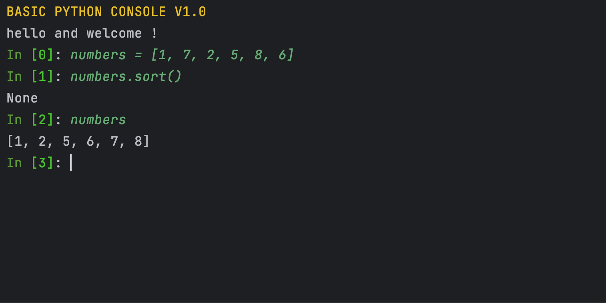

#consoledev
<h1>Quick Introduction: Version 1.0.0</h1>
<h3>Installation</h3>
You can install the module from pypi's website, or 
directly via the pip manager:  
<code>pip install consoledev</code>
 
<h3>Should I install?</h3>
If you want to make a pretty and basic console project, without 
spending the extra time to do this the right way, and eventually end up
with a messy project, then this module is for you.  

<h3>Examples of usages:</h3>
First, you need to import the needed classes:
<pre lang="python">from consoledev.consolekit import Text, TextArray, JConsole, COLORS</pre>
<h5>Example 1 - Basic Python Console:</h5>

You can create a new Console application with the <code>JConsole</code> class.

<h2>Props</h2>
<b>analysis_function</b> - a function that gets a string and returns a string. This function processes the input from the user in each line. As default, it will regard input as Python code and process it accordingly.
<b>header</b> - A Text object for the title that appears when starting the console app.
<b>starting_message</b> - A short custom message that appears in the beginning. 
<b>ending_message</b> - A short custom message that appears in the beginning. 
<b>Stop commands</b> - A list of strings that are commands for quitting the console application.

<pre lang="python">
header = Text("BASIC PYTHON CONSOLE V1.0 ", COLORS.WARNING)
python_console = JConsole(header=header, starting_message="hello and welcome !", ending_message=" goodbye !")
python_console.run()
</pre>

This was the default behavior but you can also define your own analysis function for the console, 
as long as it gets a string as a parameter and returns a string. For instance, let's define a simple echo function:
<pre  lang="python">
def echo(word: str):
    return word
     
def main():
    header = Text("ECHO CONSOLE", COLORS.OKCYAN)
    echo_console = JConsole(header=header,starting_message=Text("welcome!",COLORS.CYELLOW),analysis_function=echo)
    echo_console.run()
     
if __name__ == '__main__':
    main()
</pre>
