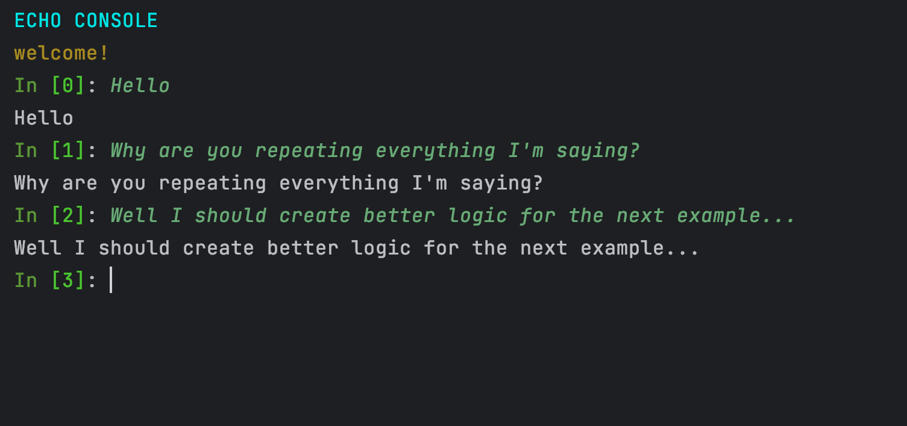

#consoledev
<h1>Quick Introduction: Version 1.0.0</h1>
<h3>Installation</h3>
You can install the module from pypi's website, or 
directly via the pip manager:  
<code>pip install consoledev</code>
 
<h3>Should I install?</h3>
If you want to make a pretty and basic console project, without 
spending the extra time to do this the right way, and eventually end up
with a messy project, then this module is for you.  

<h3>Examples of usages:</h3>
First, you need to import the needed classes:
<pre lang="python">from consoledev.consolekit import Text, TextArray, JConsole, COLORS</pre>
<h5>Example 1 - Basic Python Console:</h5>

You can create a new Console application with the <code>JConsole</code> class.

<h2>Props</h2>

<b>analysis_function</b> - a function that gets a string and returns a string. This function processes the input from the user in each line. As default, it will regard input as Python code and process it accordingly.

<b>header</b> - A Text object for the title that appears when starting the console app.

<b>starting_message</b> - A short custom message that appears in the beginning.( of type <code>str</code> or <code>Text</code> )

<b>ending_message</b> - A short custom message that appears in the beginning ( of type <code>str</code> or <code>Text</code>

<b>Stop commands</b> - A list of strings that are commands for quitting the console application.

<pre lang="python">
header = Text("BASIC PYTHON CONSOLE V1.0 ", COLORS.WARNING)
python_console = JConsole(header=header, starting_message="hello and welcome !", ending_message=" goodbye !")
python_console.run()
</pre>

This was the default behavior but you can also define your own analysis function for the console, 
as long as it gets a string as a parameter and returns a string. For instance, let's define a simple echo function:
<pre  lang="python">
def echo(word: str):
    return word
     
def main():
    header = Text("ECHO CONSOLE", COLORS.OKCYAN)
    echo_console = JConsole(header=header,starting_message=Text("welcome!",COLORS.CYELLOW),analysis_function=echo)
    echo_console.run()
     
if __name__ == '__main__':
    main()
</pre>

<h2>Colors</h2>

When creating <code>Text</code> objects we must provide a string and optionally also a color. 
There is a variety of colors that are supported <code>COLORS</code> class 

<pre lang="python">
    class COLORS:
    HEADER = '\033[95m'
    OKBLUE = '\033[94m'
    OKCYAN = '\033[96m'
    OKGREEN = '\033[92m'
    WARNING = '\033[93m'
    FAIL = '\033[91m'
    ENDC = '\033[0m'
    BOLD = '\033[1m'
    UNDERLINE = '\033[4m'
    CEND = '\33[0m'
    CBOLD = '\33[1m'
    CITALIC = '\33[3m'
    CURL = '\33[4m'
    CBLINK = '\33[5m'
    CBLINK2 = '\33[6m'
    CSELECTED = '\33[7m'

    CBLACK = '\33[30m'
    CRED = '\33[31m'
    CGREEN = '\33[32m'
    CYELLOW = '\33[33m'
    CBLUE = '\33[34m'
    CVIOLET = '\33[35m'
    CBEIGE = '\33[36m'
    CWHITE = '\33[37m'

    CBLACKBG = '\33[40m'
    CREDBG = '\33[41m'
    CGREENBG = '\33[42m'
    CYELLOWBG = '\33[43m'
    CBLUEBG = '\33[44m'
    CVIOLETBG = '\33[45m'
    CBEIGEBG = '\33[46m'
    CWHITEBG = '\33[47m'

    CGREY = '\33[90m'
    CRED2 = '\33[91m'
    CGREEN2 = '\33[92m'
    CYELLOW2 = '\33[93m'
    CBLUE2 = '\33[94m'
    CVIOLET2 = '\33[95m'
    CBEIGE2 = '\33[96m'
    CWHITE2 = '\33[97m'
    CGREYBG = '\33[100m'
    CREDBG2 = '\33[101m'
    CGREENBG2 = '\33[102m'
    CYELLOWBG2 = '\33[103m'
    CBLUEBG2 = '\33[104m'
    CVIOLETBG2 = '\33[105m'
    CBEIGEBG2 = '\33[106m'
    CWHITEBG2 = '\33[107m'

</pre>pre>
